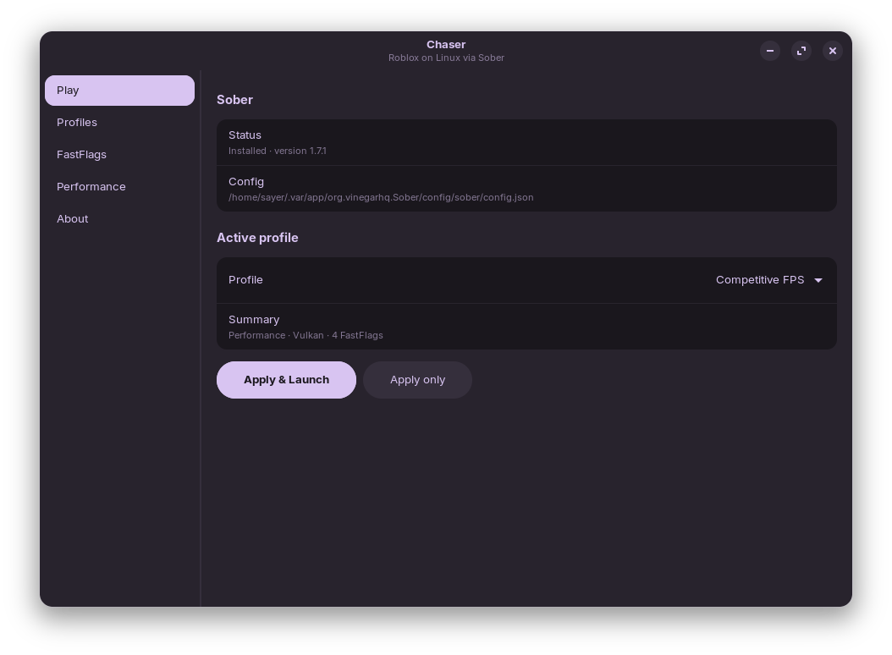
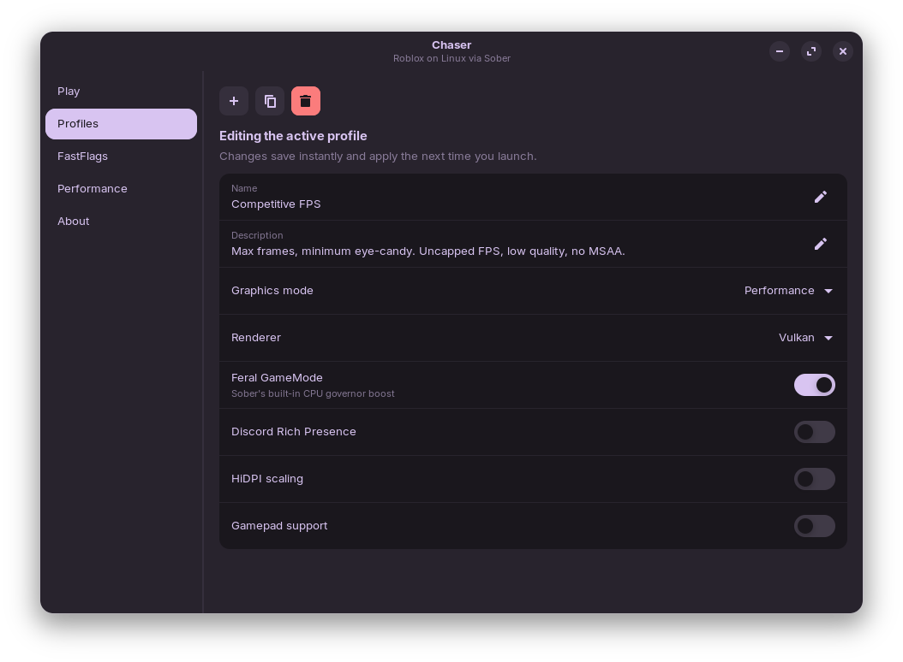
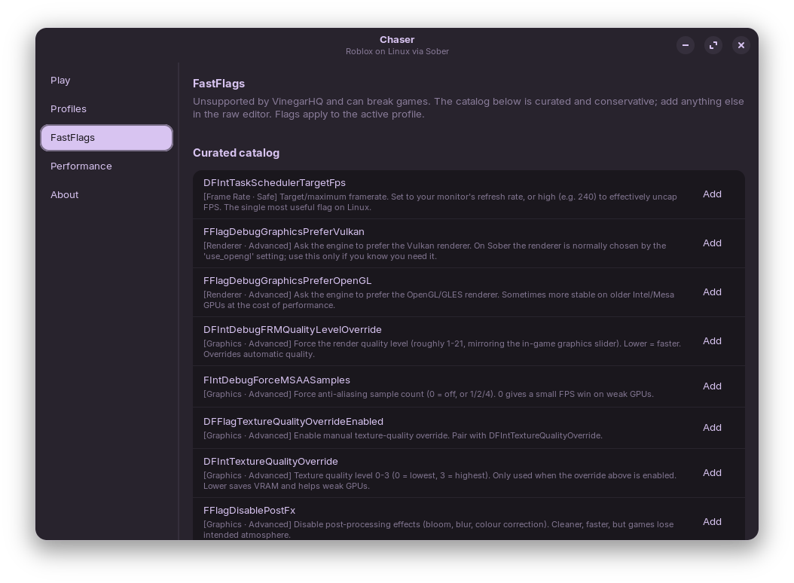

# Chaser

**A native GTK4 launcher and manager for [Sober](https://sober.vinegarhq.org/) — the way to play Roblox on Linux.**

Sober is a great *engine*: it runs the x86-64 Android build of Roblox natively on Linux, sidestepping the Hyperion anti-cheat that killed the Wine path, and it's genuinely fast. But by design it's a **minimal runtime** — VinegarHQ deliberately leaves the launcher/config layer to the community. On Windows, players have Bloxstrap; on Linux there hasn't been an equally polished equivalent.

Chaser is that cockpit. It doesn't replace Sober's runtime (that's a closed, anti-cheat-sensitive black box you shouldn't fight) — it wraps it with the things Sober leaves out: **switchable profiles, a curated FastFlag catalog, one-click performance presets, launch orchestration, and automatic config backups.**



---

## Features

- **Profiles** — named bundles of graphics mode, renderer, GameMode/RPC/HiDPI/gamepad toggles, FastFlags, and launch env. Switch between them in one click.
- **Built-in presets** — *Competitive FPS*, *Balanced*, *Cinematic*, and *Potato* (rescue mode for weak GPUs), ready to go.
- **Curated FastFlag catalog** — real, risk-tagged engine flags with plain-English descriptions, plus a raw JSON editor for power users.
- **Performance page** — apply a preset and write it to Sober in one click; toggle MangoHud; set custom environment variables.
- **Safe by construction** — Chaser parses Sober's JSONC `config.json`, **preserves its comment header and every key it doesn't manage**, writes atomically, and **backs up the previous config before every change** (under `~/.config/chaser/backups`).
- **Native & snappy** — GTK4 + libadwaita, no Electron, no web view, animations off.
- **Headless CLI** — everything the GUI does, scriptable from the terminal via `chaser`.

| Profiles editor | FastFlags |
|---|---|
|  |  |

---

## Requirements

- **[Sober](https://flathub.org/apps/org.vinegarhq.Sober)** installed via Flatpak: `flatpak install flathub org.vinegarhq.Sober`
- **GTK4 ≥ 4.14** and **libadwaita ≥ 1.4** (present on any modern GNOME-based distro)
- **Rust** (to build from source)

## Build

```sh
git clone <repo-url> chaser
cd chaser
# runtime deps on Debian/Ubuntu/Zorin:
sudo apt install libgtk-4-dev libadwaita-1-dev
cargo build --release
```

Binaries land in `target/release/`:

- `chaser-gui` — the graphical launcher
- `chaser` — the CLI

Run the GUI with `./target/release/chaser-gui`.

## CLI usage

```
chaser status              # Sober install + active profile
chaser init                # create the built-in presets
chaser profiles            # list profiles (* = active)
chaser apply <slug>        # write a profile into Sober's config
chaser launch [--profile <slug>] [--dry-run] [uri]
chaser config [--path]     # print Sober's parsed config
chaser fflags              # list the curated FastFlag catalog
chaser sessions            # recent Sober play sessions
```

## How it works

Chaser never touches the Roblox client or Sober's runtime. It:

1. reads/writes `~/.var/app/org.vinegarhq.Sober/config/sober/config.json` (Sober's own settings surface, including its `fflags` object), preserving the `// !!! STOP !!!` header and any keys it doesn't understand;
2. backs the file up before each write and writes atomically (temp file + rename);
3. launches Sober with `flatpak run org.vinegarhq.Sober`, injecting environment (MangoHud, custom vars) via `--env=`.

## A note on FastFlags

FastFlags are **unsupported by VinegarHQ** and can break games or behave unexpectedly. Chaser's catalog is deliberately conservative and every flag is risk-tagged, but you use them at your own risk. The single most useful one is `DFIntTaskSchedulerTargetFps` — set it high to uncap your framerate.

## Not affiliated

Chaser is an unofficial, community project. It is **not affiliated with Roblox or VinegarHQ**. It only edits Sober's configuration and launches it; it does not modify the Roblox client, load modified APKs, or attempt to bypass anti-cheat.

## License

MIT — see [LICENSE](LICENSE).

## Credits

Built with the assistance of **Claude** (Anthropic).
